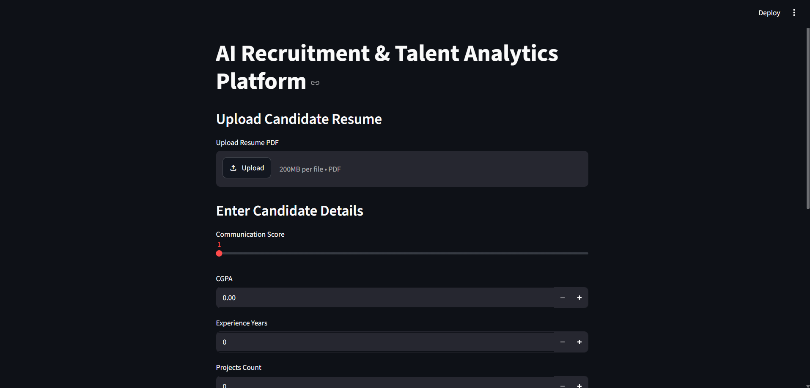
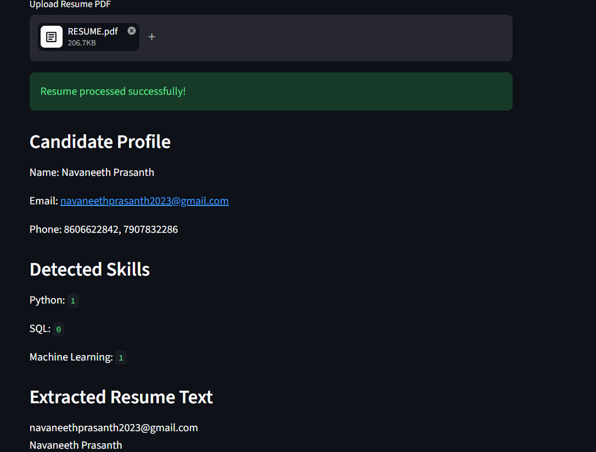
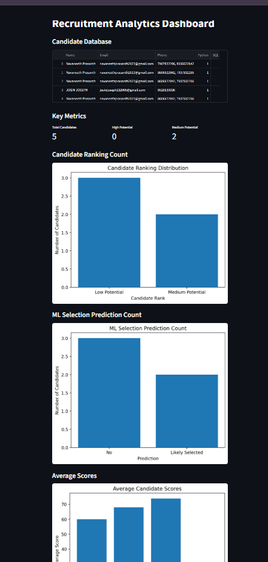
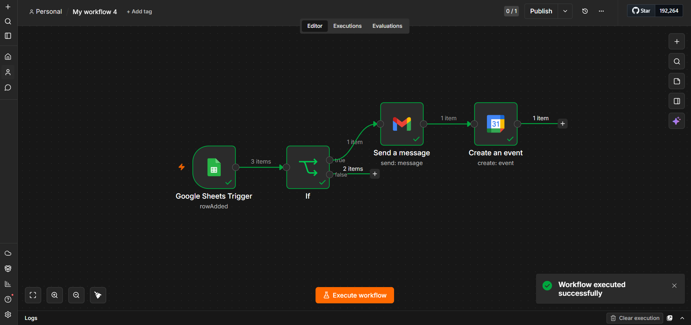

# AI Smart Recruitment System

## Overview

AI Smart Recruitment System is an intelligent recruitment platform that automates candidate screening and talent analytics using Machine Learning, Deep Learning, Resume Parsing, and Generative AI. The system helps recruiters evaluate candidates by extracting resume information, predicting hiring outcomes, estimating performance scores, generating interview questions, ranking applicants, and visualizing recruitment analytics through an interactive Streamlit dashboard.

---

## Features

### Resume Parsing

* Upload candidate resumes in PDF format
* Extract candidate details automatically:

  * Name
  * Email Address
  * Phone Number

### Skill Detection

* Detect technical skills from resumes:

  * Python
  * SQL
  * Machine Learning

### Machine Learning Prediction

* Random Forest Classification predicts candidate selection status.

### Performance Prediction

* Random Forest Regression estimates candidate performance scores.

### Deep Learning Prediction

* Artificial Neural Network (ANN) provides an additional candidate evaluation prediction.

### Candidate Ranking

Candidates are categorized as:

* High Potential
* Medium Potential
* Low Potential

### AI Interview Question Generation

* Generates technical interview questions using Llama 3 through Ollama.
* Questions are customized based on detected candidate skills.

### Candidate Database

* Stores candidate information and prediction results in CSV format.

### Recruitment Analytics Dashboard

* Candidate database visualization
* Ranking distribution analysis
* Selection prediction statistics
* Skill distribution analytics
* Average score analysis
* Top candidate identification

### n8n Automation

* Supports workflow automation for recruitment processes.
* Can be integrated with email notifications, interview scheduling, candidate tracking, and HR workflows.

---

## Technology Stack

### Frontend

* Streamlit

### Backend

* Python

### Machine Learning

* Scikit-learn
* Random Forest Classifier
* Random Forest Regressor

### Deep Learning

* TensorFlow
* Keras

### Data Processing

* Pandas
* NumPy

### Resume Parsing

* PDFPlumber
* Regular Expressions

### Data Visualization

* Matplotlib

### Generative AI

* Ollama
* Llama 3

### Automation

* n8n

---

## Project Architecture

```text
Candidate Resume
       │
       ▼
 Resume Parsing
       │
       ▼
 Skill Detection
       │
       ▼
 ┌─────────────────────┐
 │ ML Classification   │
 └─────────────────────┘
       │
       ▼
 ┌─────────────────────┐
 │ Performance Score   │
 │ Regression Model    │
 └─────────────────────┘
       │
       ▼
 ┌─────────────────────┐
 │ ANN Prediction      │
 └─────────────────────┘
       │
       ▼
 Candidate Ranking
       │
       ▼
 AI Interview Questions
       │
       ▼
 Candidate Database
       │
       ▼
 Analytics Dashboard
       │
       ▼
 n8n Automation
```

---

## Project Structure

```text
AI-Smart-Recruitment-System/
│
├── app.py
├── dashboard.py
├── main.py
├── predict.py
├── train_regression.py
├── train_ann.py
├── test_ann.py
│
├── recruitment_dataset_100_students.csv
│
├── screenshots/
│   ├── home_page.png
│   ├── resume_upload.png
│   ├── prediction_results.png
│   ├── analytics_dashboard.png
│   └── n8n_workflow.png
│
├── requirements.txt
├── README.md
└── .gitignore
```

---

## Installation

### Clone Repository

```bash
git clone https://github.com/your-username/AI-Smart-Recruitment-System.git
cd AI-Smart-Recruitment-System
```

### Install Dependencies

```bash
pip install -r requirements.txt
```

### Install Ollama

Download and install Ollama:

https://ollama.com

Pull the Llama 3 model:

```bash
ollama pull llama3
```

Run Ollama:

```bash
ollama run llama3
```

---

## Model Training

### Train Candidate Selection Model

```bash
python main.py
```

Output:

* selection_model.pkl
* label_encoder.pkl

### Train Performance Prediction Model

```bash
python train_regression.py
```

Output:

* performance_model.pkl

### Train ANN Model

```bash
python train_ann.py
```

Output:

* ann_selection_model.h5
* ann_label_encoder.pkl

---

## Running the Application

### Launch Recruitment Platform

```bash
streamlit run app.py
```

### Launch Analytics Dashboard

```bash
streamlit run dashboard.py
```

---

## Screenshots

### Home Page




---

### Resume Upload & Skill Detection




---

### Candidate Prediction Results


---

### Recruitment Analytics Dashboard




---

### n8n Recruitment Automation Workflow




This workflow automates recruitment-related activities such as candidate notifications, interview scheduling, email communication, and HR process management.

---

## Workflow

1. Upload candidate resume.
2. Extract candidate details.
3. Detect technical skills.
4. Enter candidate evaluation scores.
5. Predict candidate selection status.
6. Estimate candidate performance score.
7. Generate ANN prediction.
8. Rank candidate potential.
9. Generate AI interview questions.
10. Save candidate data and results.
11. Visualize recruitment analytics.
12. Automate recruitment tasks using n8n workflows.

---

## Future Enhancements

* Advanced NLP-based resume parsing
* Multi-skill extraction using transformer models
* Candidate recommendation engine
* Automated interview scheduling
* Cloud deployment
* Email notification automation
* Real-time recruitment analytics
* Multi-user HR management system
* Integration with Applicant Tracking Systems (ATS)

---

## Results

The system successfully combines:

* Machine Learning Classification
* Machine Learning Regression
* Deep Learning (ANN)
* Resume Analytics
* Generative AI
* Talent Intelligence
* Recruitment Analytics
* Workflow Automation

to provide a complete AI-powered recruitment solution.

---

## Author

**Developed as an AI, Machine Learning, Deep Learning, and Generative AI project for intelligent recruitment and talent analytics.**
